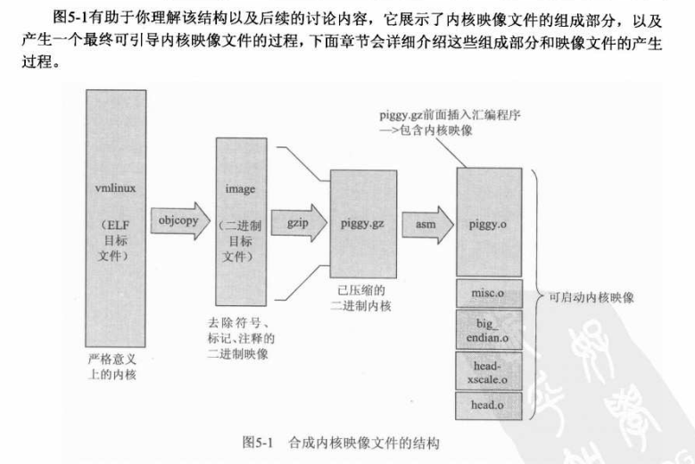
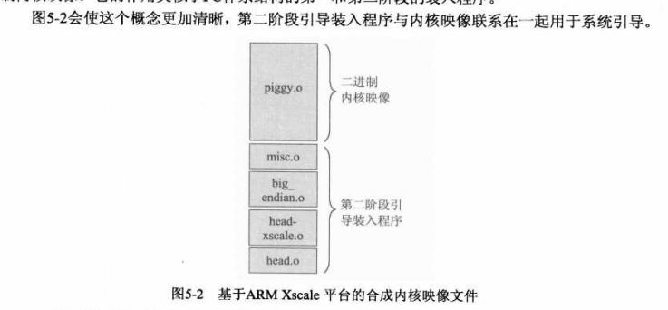

# 原理图
> 微机原理: 侧重于计算机结构  
> 数字电子技术基础: 侧重于门电路  

## GPIO和门电路
### 输入/输出引脚，上/下拉电阻，三极管
- GPIO怎么用
  * 查看datasheet配置引脚功能: **GPFCON/GPFDAT/GPFUP**
    * 输入引脚
      * 读寄存器值
    * 输出引脚
      * 写值到寄存器
- 上/下拉电阻: 用来确定悬空引脚的电平状态
- 三极管
  - NPN/PNP

### 与/或/非门
- 略

### 中断(也可通过轮训输入引脚，但是效率低)
- 具备输入功能
- 可以中断CPU

## 协议类
- 要求
  * 通信的双方能听懂对方的话：双方约定协议
  * 说话语速要匹配接受：双方满足时序要求
### UART：universal async receive transmit 通用异步收发传输器
- 电平转换芯片
  - 开发板-->电平转换芯片-->串口座-->串口线-->PC
  - 开发板只有0/3V表示0/1，低抗扰性，需要转换芯片转换成(9~12)/(-9~-12)表示0/1
- 如何传数据
  - 起始位
  - 停止位
  - 传输数据
- 串口控制器
### I2C
### SPI
### NAND
### LCD

## 类似内存的接口


# 嵌入式Linux基础
## Linux内核
### 内核构造
- 顶层资源目录 /usr/src/linux-x.y.z
- 第一行代码：head.S
#### 严格意义上的内核 vmlinux
- vmlinux 和 System.map
  - vmlinux: 严格意义上的内核，采用ELF格式，包含符号、注释、调试信息和通用体系结构组件
  - System.map: 描述vmlinux模块的内核符号表，基于文本格式
- [vmlinux、zImage、uImage](https://blog.csdn.net/cjsycyl/article/details/21014015)
  - vmlinux: 原滋原味的linux内核，编译出来的最原始的内核文件，未压缩过
  - zImage/bzImage: 由vmlinux使用gzip压缩得到，**"make zImage/bzImage"**
    > 两者的不同之处在于，zImage解压缩内核到低端内存(第一个640K)，bzImage解压缩内核到高端内存(1M以上)。如果内核比较小，那么采用zImage或bzImage都行，如果比较大应该用bzImage。  
  - vmlinuz: 可引导的、压缩的内核。“vm”代表“VirtualMemory”
    - 其实就是zImage或者bzImage，通常是**拷贝或者软链接**
  - uImage: 在zImage的头部加上0x40长度的内容，说明这个映像文件的类型、加载位置、生成时间、大小等信息
    - uImage是u-boot使用bootm命令引导的Linux压缩内核映像文件格式
    - 可以由bootm命令从任意地址解压启动内核
    - 由于bootloader一般要占用0X0地址，所以，**uImage相比zImage的好处就是可以和bootloader共存**
  - initrd: "initial ramdisk",
    - initrd一般被用来临时的引导硬件到实际内核vmlinuz能够接管并继续引导的状态
- </img>
- </img>
- </img>

## 内核初始化
### 合成内核映像
- 内核映像结构
  - vmlinux -> Image -> piggy.gz -> 可启动内核映像
  - </img>
- Image 目标文件
  ``` shell
  xscale_be-objcopy -O binary -R .note -R .comment -S vmlinux arch/arm/boot/Image
  ```
  > Image就是二进制格式的内核文件，它去掉了调试符号、.note和.comment ELF段
- 体系结构相关的目标文件
  ``` shell
  gzip -f -9 < Image > piggy.gz
  ```
  > 将Image压缩之后，引入一个 **piggy.S** 的汇编文件进行汇编，该文件包括对压缩文件piggy.gz的说明，可看上图
- 第二阶段引导装入程序 bootstrap loader
  - 与引导装入程序bootloader不同，bootloader可以当作第一阶段引导装入程序
  - 区别：
    - bootloader在上电时取得控制权，并且不依赖内核
    - 第二阶段引导程序当作是 bootloader 和 内核 ，给内核运行提供了合适的上下文，同时还执行了一些 **必要的操作：如有解压并且重新部署二进制内核映像**
    - 如下图，第二阶段引导装入程序是和内核映像放在一起的
    </img>
  